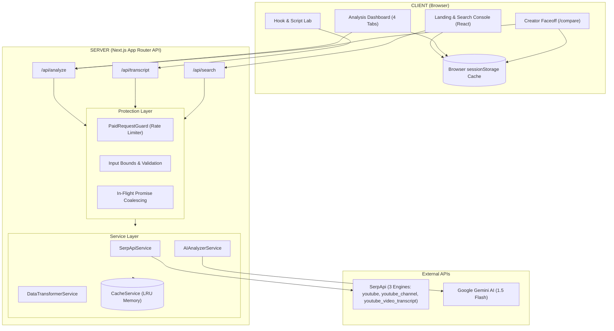

# TubeSignal — Architecture Document

> **Version:** 2.0  
> **Last Updated:** October 2, 2026  
> **Stack:** Next.js (App Router) + TypeScript + Turbopack + SerpApi + Gemini AI + Chart.js  
> **Hackathon Track:** Knowledge & Public Interest (Education / Research)  
> **Deadline:** October 10, 2026, 23:59 IST  

---

## 1. High-Level Architecture



---

## 2. Tech Stack

| Layer | Technology | Rationale |
|---|---|---|
| **Framework** | Next.js 16 (Turbopack, App Router) | Server-side API protection, server components, fast routing |
| **Language** | TypeScript | Strict type safety across raw API payloads and transformed datasets |
| **Styling** | Vanilla CSS + CSS Modules | Bespoke design system, dark-mode glassmorphism, zero runtime bloat |
| **Data Provider** | SerpApi (3 Engines) | Google search, channel details, and speech transcript intelligence |
| **AI Layer** | Google Gemini 1.5 Flash | Fast, cost-effective synthesis with deterministic server baseline |
| **Visualization** | Chart.js 4 + react-chartjs-2 | High-performance canvas data charts with disabled animations |
| **Icons** | Lucide React | Clean, lightweight icon suite |
| **Deployment** | Vercel | Seamless edge/node hosting for Next.js |

---

## 3. Project Structure

```
c:\Projects\SerpApi-hackathon-project\
├── docs/                      # Architectural, PRD, and task documentation
├── public/                    # Static assets, branding, and icons
├── scripts/                   # Local CI checks and mock testing
├── src/
│   ├── app/
│   │   ├── analyze/[channelId]/ # Main channel analysis dashboard
│   │   ├── compare/           # Head-to-head creator faceoff
│   │   ├── api/
│   │   │   ├── analyze/       # Full channel analysis pipeline
│   │   │   ├── search/        # Channel discovery fuzzy search
│   │   │   └── transcript/    # Video speech & hook breakdown
│   │   ├── layout.tsx         # Root HTML, fonts, and meta tags
│   │   └── page.tsx           # Visual intelligence landing page
│   ├── components/
│   │   ├── charts/            # Chart.js visualization components
│   │   ├── dashboard/         # Dashboard tabs (Verdict, HookLab, etc.)
│   │   ├── layout/            # Header, Footer, and Navigation
│   │   ├── search/            # Instant channel discovery modal
│   │   └── ui/                # UI primitives (badges, buttons, cards)
│   ├── hooks/                 # Custom React hooks (useAnalysis with cache)
│   ├── lib/                   # Chart theme and global utilities
│   ├── services/              # SerpApi, Gemini AI, Transformer, Cache
│   ├── types/                 # TypeScript type declarations
│   └── utils/                 # Formatting, prompts, report generator
└── package.json
```

---

## 4. 3 SerpApi Engines Integration

| Engine | Endpoint | Role in TubeSignal | Cache TTL |
|---|---|---|---|
| `youtube` | `/api/search` | Creator name lookup & channel discovery | 30 min |
| `youtube_channel` | `/api/analyze` | Channel profile, statistics, latest ~30 uploads | 30 min |
| `youtube_video_transcript` | `/api/transcript` | Full video captions for opening 40s hook analysis | 24 hours |

---

## 5. API Preservation & Rate Limiting Strategy

1. **Client Browser Cache (`sessionStorage`)**:
   - Analysis results are saved immediately in `sessionStorage`.
   - Page refreshes (F5), page navigation to `/compare`, and tab switching use **0 API calls** and **0 Gemini credits**.
2. **Server Process Cache (`CacheService`)**:
   - Bounded LRU in-memory cache with TTL.
   - Assembled analyses are cached for 1 hour; raw API responses for 30 minutes; transcripts for 24 hours.
3. **In-Flight Coalescing**:
   - Deduplicates simultaneous requests for the same channel, executing only one upstream call.
4. **Paid Quota Guard (`PaidRequestGuard`)**:
   - Enforces a hard ceiling of 20 SerpApi requests/minute and 10 Gemini requests/minute to prevent credit exhaust.
5. **Deterministic Offline Fallbacks**:
   - Demo channels (`mkbhd`, `fireship`, `veritasium`) are served locally with zero API dependency.
   - When Gemini is unconfigured or rate-limited, computed statistical analysis is produced instantly without crashing.

---

## 6. Multi-Format Dossier Export System

In [report-generator.ts](file:///c:/Projects/SerpApi-hackathon-project/src/utils/report-generator.ts):
- **Standalone HTML Dossier (`.html`)**: Self-contained, responsive report embedding all styles and data offline.
- **Executive Markdown (`.md`)**: Structured creator brief suitable for Notion, Obsidian, or GitHub.
- **Raw JSON Dataset (`.json`)**: Machine-readable dataset for data analysts and researchers.
- **Clipboard & Social**: Clean preview card copying and direct sharing to X and LinkedIn.
